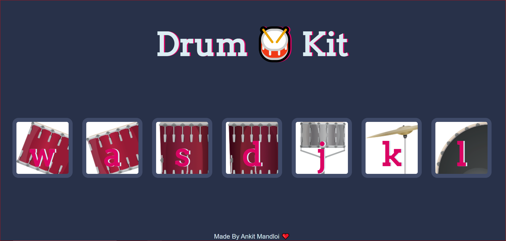

# Drumkit Project

This is a simple JavaScript-based Drumkit application that allows users to play different drum sounds by clicking on drum images or pressing corresponding keys on the keyboard. 

## Technologies Used

- **HTML**: For the structure of the application.
- **CSS**: For styling the UI elements.
- **JavaScript**: For handling the logic and sound effects.

